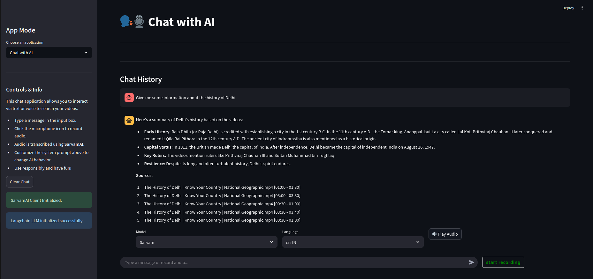
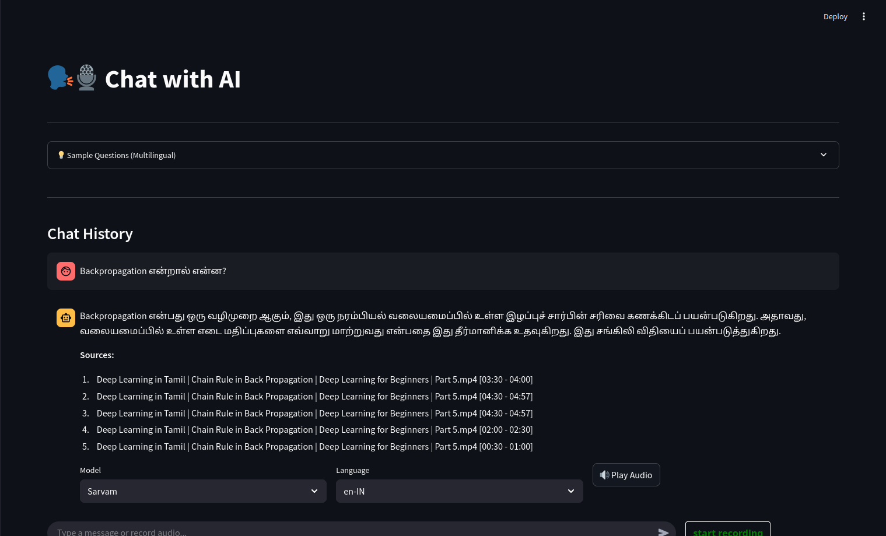
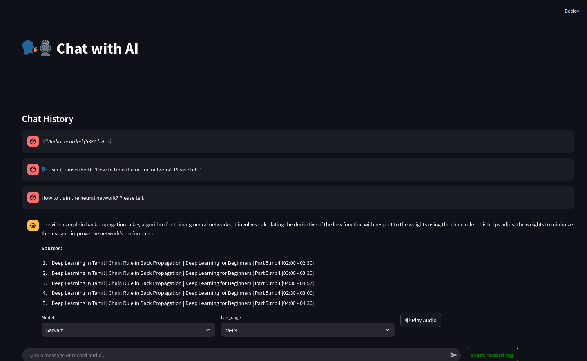
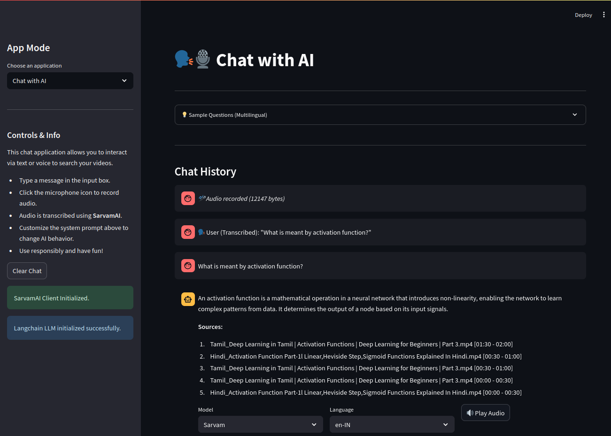
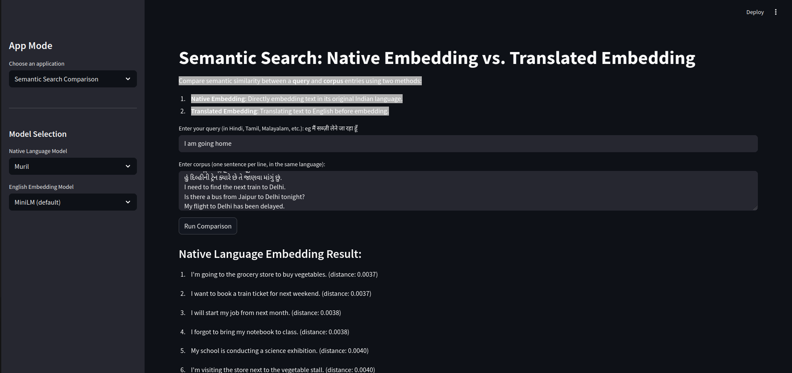

# Indic Video Search App and Comparative Analysis of Language Models for Key components of the RAG pipeline

## Environment Setup

 - Please install Python 3.12 if not available

 - Create a Virtual Env in the root directory
 ```bash
 python3.12 -m venv searchenv
 source searchenv/bin/activate
 ```

- Add all relevant API keys
```bash
export SARVAMAI_API_KEY="<YOUR-KEY>"
export GEMINI_API_KEY="<YOUR-KEY>"
```
 - Install libraries
 ```bash
 sudo apt install ffmpeg
 pip3 install -r requirements.txt
 ```

- Process Some videos first. You will need the GEMINI_API_KEY to do this step. Otherwise you can use the already available chroma db in the chroma_db folder.
```bash
# There is a sample video in the videos folder. You can add more videos here. THen run
rm -rf chroma_db/chroma.sqlite3 #Optional step. There is a preprocessed db here. You can start fresh if you delete this d

python3 process_videos.py #Follow the interactive mode
```

 - Run the streamlit app
 ```bash
 streamlit run main_app.py
 (or)
 streamlit run main_app.py --server.fileWatcherType none #If you see some torch related errors in the terminal. You will have to manually restart the streamlit app from terminal after every file change in this case as the run & rerun commands won't be available
 ```

 ## Running Evaluations
 - Rag Evaluation
  ```bash
  export PYTHONPATH=$PWD
  python3 rag_eval/rag_eval.py --dataset all
```
  - You can also run evaluation for a specific dataset. The available dataset ids in the uploaded chroma_db are:
    - dataset_id = ['tamil_activation_functions', 'deep_learning_tamil', 'delhi_history', 'activation_functions']
  - So the above command will look like:
  `python3 rag_eval/rag_eval.py --dataset delhi_history`

- TTS & STT Evaluations
  After you have configured Google Cloud TTS & STT keys, you can run:
  `python3 llm_comparison/llm_compare_stt_tts.py`

- Video Processing Comparison:
  - The code for executing summarization from Gemini and GPT family of models are provided in `rag_pipeline` directory. The `process_videos.py` script can be run with the classes there. Please comment out the relevant imports in `process_videos.py` to execute the same. The outputs are manually compared to check factual accuracy, key visual event descriptions & quality of Indic Language transcription from frames
- Embedding Model Evaluation:
  - The JuPyter Notebook `embedding-comparison.ipynb` has all the relevant information for embedding model comparison

- Query Transformation Comparison
  Same steps as Rag Eval. Run this script instead:
  `  python3 rag_eval/rag_eval.py --dataset all`
## Documentation

For a detailed analysis of our search approaches and performance metrics, please refer to our [Comparative Analysis Paper](docs/Comparative_Analysis_Paper.pdf).

## App Screenshots:

Our Chat App supports both Text & Voice inputs.

### Text input


You can also ask questions in code-mixed language. There are a few sample questions given in the main app page for you to try out:


### Voice input & Voice Output



### Embedding Model Comparison Companion App
The  Embedding Model Comparison Companion app can be accessed from the dropdown menu in the top left. It allows you to feed in a multilingual data corpus and a query. A semantic similarity comparison between a query and corpus entries is done and displayed using two methods:
  - Native Embedding: Directly embedding text in its original Indian language.
  - Translated Embedding: Translating text to English before embedding.
More details about this companion app and its use can be found in the above paper

